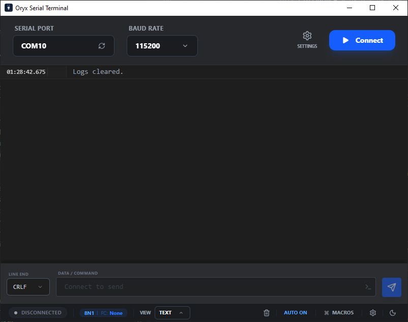

# ORYX - Premium Serial Terminal

[](https://tauri.app/)
[](https://react.dev/)
[](https://www.rust-lang.org/)
[](LICENSE)

**ORYX** is a premium, high-performance serial terminal designed for modern developers and engineers. Built with the speed of **Rust** and the flexibility of **React**, it offers a rock-solid cross-platform experience for all your serial communication needs.



---

## ✨ Key Features

- 💎 **Premium UI**: Stunning design with glassmorphism, smooth animations, and handcrafted themes (Dark & Light).
- 🚀 **High Performance**: Virtualized terminal view capable of handling massive data streams without breaking a sweat.
- 🛠️ **Advanced Configuration**: Granular control over Baud Rate, Data Bits, Stop Bits, Parity, and Flow Control.
- 📟 **Smart View Modes**: Toggle between **Text**, **Char**, **Hex**, **Bin**, **Dec**, and **Oct** views on the fly.
- 🔥 **Macro System**: Save, categorize (with color-coded badges), and execute your most used commands with a single click.
- 📋 **Flexible Line Breaking**: Break lines based on **Timeout**, **Byte Count**, **Chunks**, or specific **Sequences** (Before/After).
- 📂 **Session Logging**: Robust logging system with automated directory management and session history.
- ⚡ **ESC Sequences**: Full support for escaped characters and C-style strings in TX data.

---

## 🏗️ Tech Stack

- **Backend**: Rust (Tauri v2)
- **Frontend**: React + TypeScript + Tailwind CSS
- **Communication**: `tauri-plugin-serialport`
- **UI Components**: Lucide-React, React Virtuoso (High-Performance List)

---

## 🛠️ Development

### Prerequisites
- [Rust](https://www.rust-lang.org/tools/install)
- [Node.js](https://nodejs.org/)
- OS-specific Tauri dependencies ([Prerequisites](https://tauri.app/v1/guides/getting-started/prerequisites))

### Setup
```bash
# Install dependencies
npm install

# Run in development mode
npm run tauri dev
```

### Build
```bash
# Build the production executable
npm run tauri build
```

---

## 📝 License
Distributed under the MIT License. See `LICENSE` for more information.

---
Proudly developed with **ORYX** - The future of serial debugging.

## 👤 Author

Erkan Bekdemir  
Embedded Systems Engineer | IoT | Edge Systems  
🔗 LinkedIn: https://linkedin.com/in/erkanbekdemir